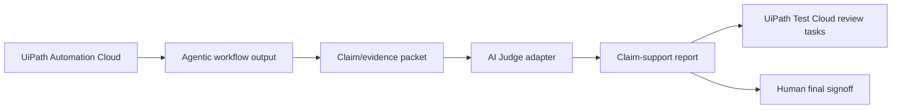

# Architecture

This repo demonstrates an adapter layer between UiPath-orchestrated agentic testing workflows and an AI Judge-style claim-support gate.

## Flow

## Data Boundaries

| Boundary | Input | Output |
|---|---|---|
| UiPath workflow to adapter | agent summary, claim list, evidence snippets, workflow metadata | normalized claim/evidence packet |
| Adapter to report | claim/evidence packet | JSON report with `verified`, `weakly_verified`, `unverifiable`, or `contradicted` statuses |
| Report to UiPath Test Cloud | blocking claim results | review tasks, test ideas, release-gate evidence |
| Report to human approver | final HTML/JSON/Markdown evidence package | go/no-go decision |

## Why Test Cloud

The strongest UiPath AgentHack track fit is **Track 3: UiPath Test Cloud** because AI Judge is a quality gate for AI-generated automation outputs:

- requirements interpreted by agents
- tests generated by agents
- release notes written by agents
- automation failure explanations written by agents
- business decisions routed through agents

The adapter turns unsupported claims into test or review work instead of allowing a polished AI summary to pass as proof.

## License Boundary

This MIT repo contains adapter/demo code only. The upstream AI Judge core remains separate and can be connected as:

- a local CLI call
- a private service endpoint
- a Hugging Face demo during judging
- a future UiPath API Workflow integration

The public hackathon adapter can stay MIT even if the upstream judge layer uses a different license.

